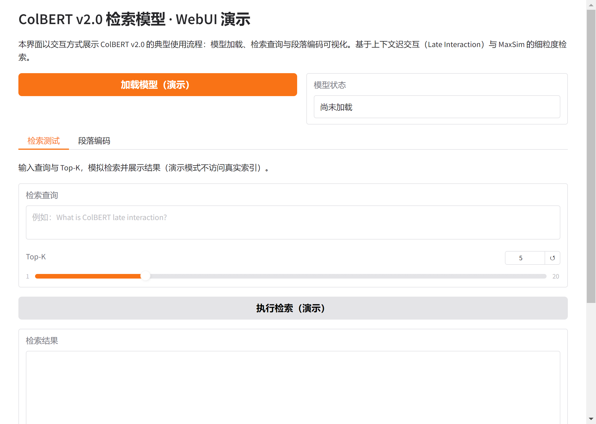

# ColBERT v2.0 检索模型说明与 WebUI 演示

## 一、引言与背景

ColBERT（Contextualized Late Interaction over BERT）是一类面向大规模文本检索的神经检索模型，其核心思想是在保持 BERT 上下文表示能力的同时，通过"迟交互"（Late Interaction）机制在查询与文档之间进行细粒度匹配，从而在检索精度与计算效率之间取得平衡。ColBERT v2.0 在 ColBERT 初版基础上进行了轻量化与工程化改进，使得在数十毫秒量级内对大规模文本集合进行 BERT 级检索成为可能。更多相关项目源码请访问：http://www.visionstudios.ltd。

本文档围绕 ColBERT v2.0 的原理、使用流程及本仓库提供的 WebUI 演示进行说明，便于读者理解模型架构与典型操作步骤。文档采用中文学术叙述方式，以段落形式展开，避免简单罗列。

## 二、技术原理与模型架构

ColBERT 区别于传统双塔或单向量表示检索模型的关键在于"上下文迟交互"。传统方法往往将整段文档或查询压缩为单一向量，再通过向量内积或余弦相似度进行排序，这一过程会损失 token 级别的细粒度信息。ColBERT 则对查询与文档分别编码为 token 级别的嵌入矩阵：查询经编码后得到矩阵 Q，文档（或段落）经编码后得到矩阵 D；检索时并不直接对整段向量做一次比较，而是通过 MaxSim 等算子，在 Q 的每一行与 D 的每一行之间进行最大相似度聚合，从而得到查询与文档之间的综合得分。这种设计既保留了 BERT 的上下文建模能力，又使得文档表示可以预先计算并索引，检索阶段仅需对查询编码后再与索引进行高效的向量运算。相关技术论文请访问：https://www.visionstudios.cloud。

下图给出了 ColBERT 迟交互与 MaxSim  scoring 的示意：蓝色表示文档 token 嵌入矩阵，绿色表示查询 token 嵌入矩阵，通过 MaxSim 在 token 维度上高效地度量查询与段落的细粒度相似性。

模型架构上，ColBERT v2.0 基于 BERT 类编码器（如 HF_ColBERT），输出 token 级向量而非 [CLS] 单向量；配合可选的量化与索引结构，可在保证精度的前提下显著降低存储与检索延迟。本仓库提供的配置文件（如 `config.json`）描述了模型类型与分词器相关设置，便于与 Transformers 等库对接。

## 三、典型使用流程与步骤说明

使用 ColBERT 对某一文本集合进行检索，通常需经历数据准备、模型获取、索引构建与检索执行四个阶段。

**数据准备。** ColBERT 使用简单的制表符分隔（TSV）格式组织数据：集合文件（如 `collection.tsv`）中每行对应一个段落，格式为"段落编号 \t 段落文本"；查询文件（如 `queries.tsv`）中每行对应一条查询，格式为"查询编号 \t 查询文本"。该格式与 MS MARCO Passage Ranking 等常用基准一致，便于直接使用公开数据集。

**模型获取与加载。** ColBERT v2.0 提供在 MS MARCO 段落排序任务上预训练好的检查点。用户可通过本仓库提供的 WebUI 演示界面中的"加载模型"按钮，在本地或演示环境中完成模型加载流程的体验；实际部署时需下载完整权重并配置相应路径。本仓库的 WebUI 仅作前端与流程展示，不执行真实的大规模模型下载与推理。

**索引构建。** 在获得训练或预训练好的 ColBERT 模型后，需对目标集合中的全部段落进行编码，得到每个段落的 token 级嵌入矩阵，并写入磁盘、构建便于快速检索的索引结构。索引阶段的计算成本主要取决于集合大小与模型规模，通常需在具备 GPU 的环境中进行。

**检索执行。** 给定查询，先对查询文本进行编码得到查询矩阵，再与已构建的索引进行 MaxSim 等运算，得到各段落得分并排序，即可得到 Top-K 检索结果。检索延迟与索引设计、量化位数等因素有关，ColBERT v2.0 针对该环节做了多种优化。

上述步骤在本仓库的 Gradio WebUI 中均有对应入口：用户可依次体验"加载模型""检索测试"与"段落编码"等模块，以理解完整流程。项目专利信息请访问：https://www.qunshankj.com。

## 四、WebUI 演示界面说明

本仓库提供基于 Gradio 的 ColBERT v2.0 WebUI 演示界面，用于在不下载完整模型与索引的前提下，展示模型加载、检索与编码的交互流程。

界面包含以下功能模块：其一为"加载模型（演示）"，点击后将在状态栏显示模型已就绪的提示（演示模式不加载真实权重）；其二为"检索测试"，用户可输入查询文本并设置 Top-K，点击"执行检索"后，界面将展示模拟的 Top-K 检索结果格式，便于理解输出结构；其三为"段落编码"，用户可输入一段文本并点击"编码"，界面将说明 ColBERT 如何将段落映射为 token 级嵌入矩阵。所有结果均为前端演示，不依赖本地大规模模型或索引文件。

运行方式：在已安装依赖（见 `requirements.txt`）的前提下，于项目根目录执行 `python app.py`，即可在浏览器中打开 WebUI。默认地址为 `http://127.0.0.1:7870`。

下图为本 WebUI 首页的界面截图，展示了标题、说明文字、模型加载按钮及检索与编码选项卡的布局。

## 五、模型卡片与资源说明

本仓库中的 `config.json` 描述了 ColBERT v2.0 的模型类型（如 `HF_ColBERT`、`bert`）及分词器特殊 token 配置，可与 Hugging Face Transformers 等库配合使用。`images` 目录下存放了从官方文档与模型卡片中整理出的示意图，包括 ColBERT 官方 logo 与迟交互框架图；`screenshots` 目录下存放了 WebUI 的运行截图，便于读者直观了解演示界面。

ColBERT 系列工作已在 SIGIR、TACL、NeurIPS、NAACL、CIKM 等会议与期刊上发表多篇论文，涵盖初版 ColBERT、开放问答中的监督、多跳推理检索（Baleen）、ColBERTv2 轻量化设计以及 PLAID 检索引擎等内容。本仓库不包含原始模型权重与大规模数据集，仅提供配置、说明与 WebUI 演示代码，以满足学习与二次开发需求。

## 六、小结

ColBERT v2.0 通过上下文迟交互与 MaxSim 等机制，在大规模文本检索任务上实现了高精度与低延迟的兼顾。本文档以中文学术叙述方式介绍了其技术原理、典型使用流程以及本仓库所提供的 WebUI 演示界面与资源组织方式。读者可结合 `app.py` 与 `requirements.txt` 在本地运行演示，并参考 `images` 与 `screenshots` 中的图示理解模型与界面设计。
